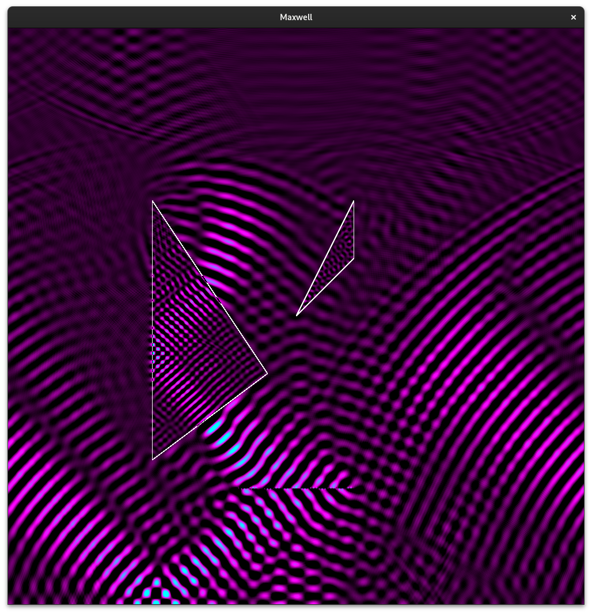

# maxwell
A 2D FDTD solver for Maxwell's equations

## Features
Maxwell is a work in progress. Currently, it offers:
 * GPU acceleration via OpenCL, with CPU fallback
 * User-defined sources coupled to arbitrary field components
    * Sinusoids with linear frequency as argument
 * User-defined regions of arbitrary DC material properties (permittivity and permeability)
    * Triangle
 * Live simulation rendering
 * User-interactivity
 * Multiple visualization functions

## Usage
To use Maxwell, you must call it with a single argument:
 > ./maxwell [sim_file]

Where sim_file is a user-created configuration file specifying a simulation to run. See [Simulation Files](#simulation-files) for more details.
While the simulation is running, there are a variety of options for user-interactivity:
 * [Space] - Pause/resume the simulation
 * [Ctrl]+[C] - Exit the program
 * [B] - Toggle rendering of material boundaries
 * [F] - Report current average framerate
 * [R] - Reset the simulation to its initial state
 * [V] - Cycle between visualization functions

## Simulation Files
A simulation file consists of multiple sections: `[Simulation]`, `[Sources]`, and `[Materials]`. To begin a section, simply specify its complete name (including square brackets) on a line of its own. Options for the section follow on their own lines. Here are the currently available options:
> [Simulation]  
> Width [Width]  
> Height [Height]  
>  
> [Sources]  
> SineLinFreq [FieldComponent] [x] [y] [LinearFrequency] [Phase]  
>  
> [Materials]  
> Triangle [RelativePermittivity] [RelativePermeability] [x1] [y1] [x2] [y2] [x3] [y3]  

See the `examples` folder for example simulation files.

## Building
If you want to use GPU acceleration, you'll need OpenCL. Regardless, you will also need OpenGL and GLFW. Installation will depend on your distribution.
Simply run `make` to compile the binary. For a fun demo:

> ./maxwell examples/phased_array_prisms.sim

